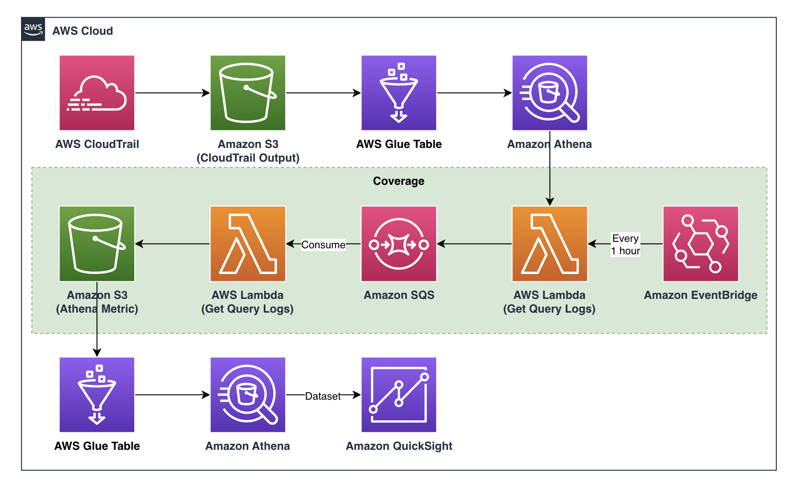

# Athena Metric Usage Sample

## Architecture



## Usage
Prepare Following Resources and edit file `packages/infra/pipeline.ts`
  - cloudTrailRegion: "<CLOUDTRAIL_REGION>",
  - cloudTrailBucket: "<CLOUD_TRAIL_OUTPUT_BUCKET>",
  - cloudTrailTableName: "<CLOUD_TRAIL_ATHENA_TABLE_NAME>",
  - athenaResultBucket: "<ATHENA_RESULT_BUCKET>",

```
# cd packages/infra
$ npx cdk deploy PipelineStack

# push code to generated code commit repository

# or you can deploy directly
$ npx cdk deploy Dev/AthenaMetricApplication
```